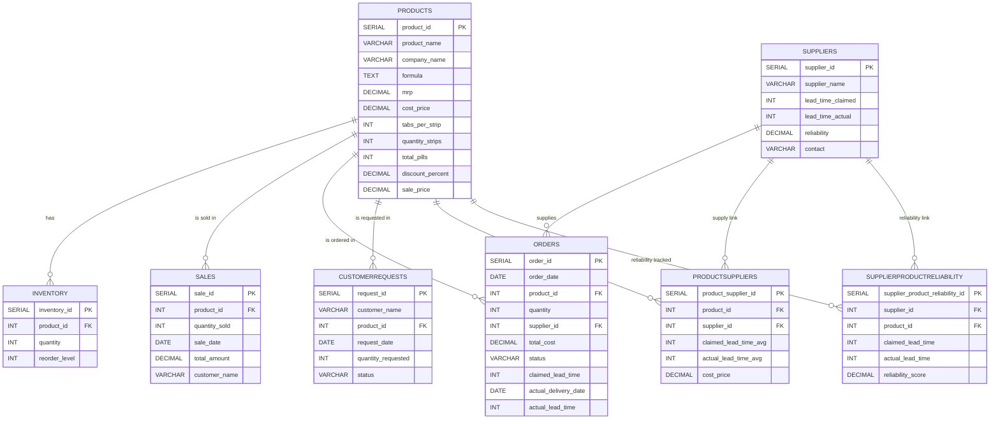

# Getting Started

## Data Schema (ER Diagram)


## Prerequisites

The following steps require [NodeJS](https://nodejs.org/en/) and [Python](https://www.python.org/) to be installed on your system. Please install them beforehand if you haven't already.

## Steps to Set Up the Project

### Clone the repository:
   ```bash
   git clone https://github.com/shubhanshu1911/Study_Copilot.git
   ```

### Set Up Frontend
1. Install required node modules for frontend
   ```bash
    npm install
   ```
   
2. Run the Backend server
   ```bash
    npm run dev
   ```

### Set Up Main Backend (api folder)
1. Install required node modules for backend
   ```bash
    npm install
   ```
   
2. Run the Backend server
   ```bash
    node server.js
   ```

### Set Up ML backend (pharmaML folder)
1. Install Virtual Environment (if it doesn't already exist):
   ```bash
   python3 -m pip install --user virtualenv
   ```

2. Create a virtual environment:
   ```bash
   python -m venv <environment_name>
   ```

3. Activate the virtual environment:
   ```bash
   source <environment_name>/bin/activate
   ```

4. Install the reqiured packages
    ```bash
    pip install -r requirements.txt
    ```

5. Run the ML server
    ```bash
    python3 main.py
    ```
